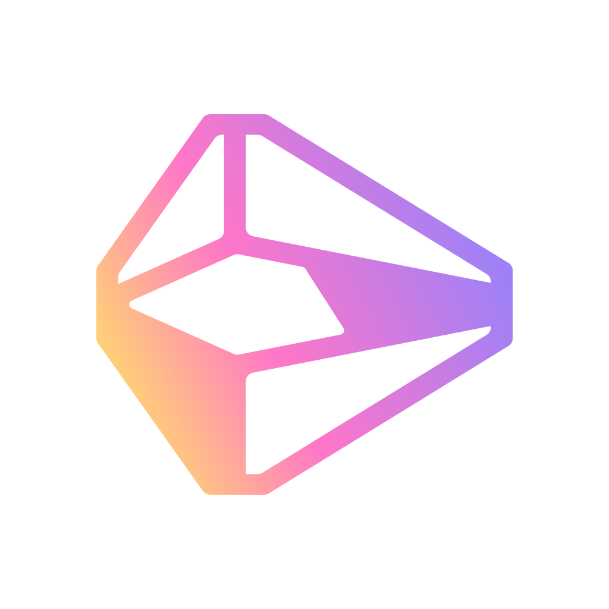
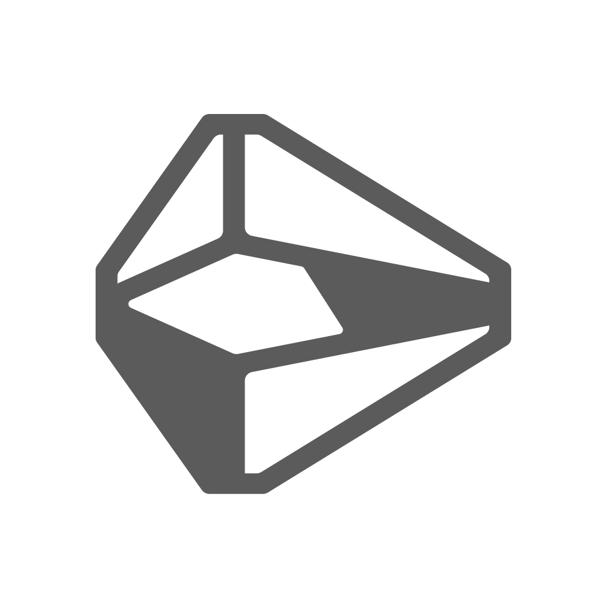
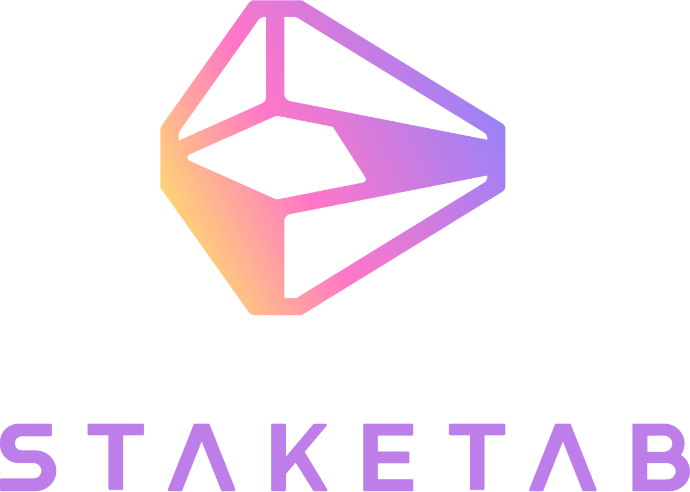
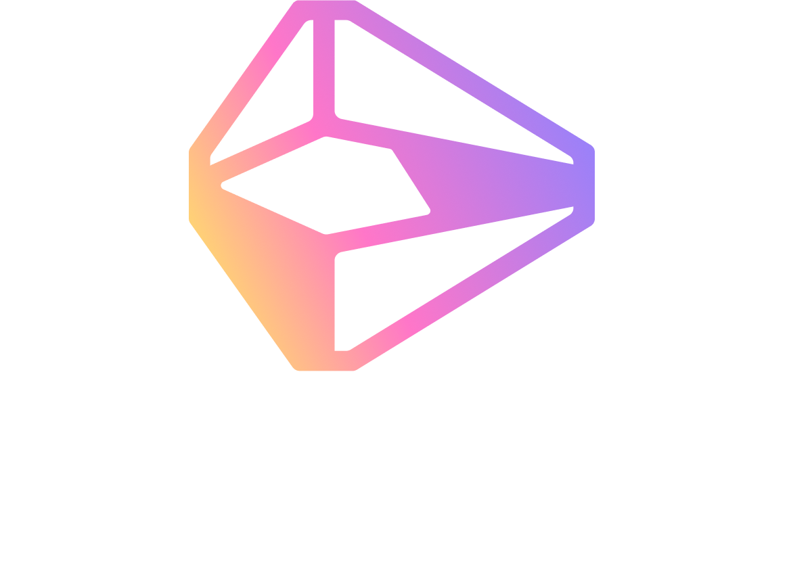
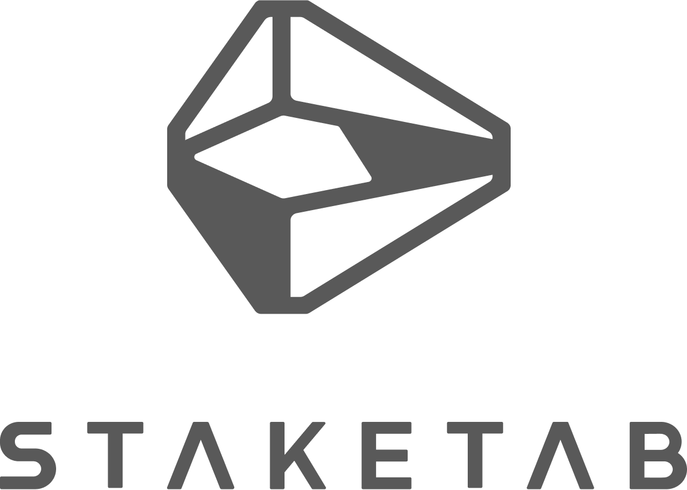
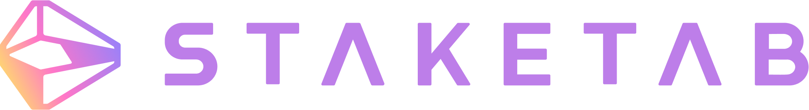
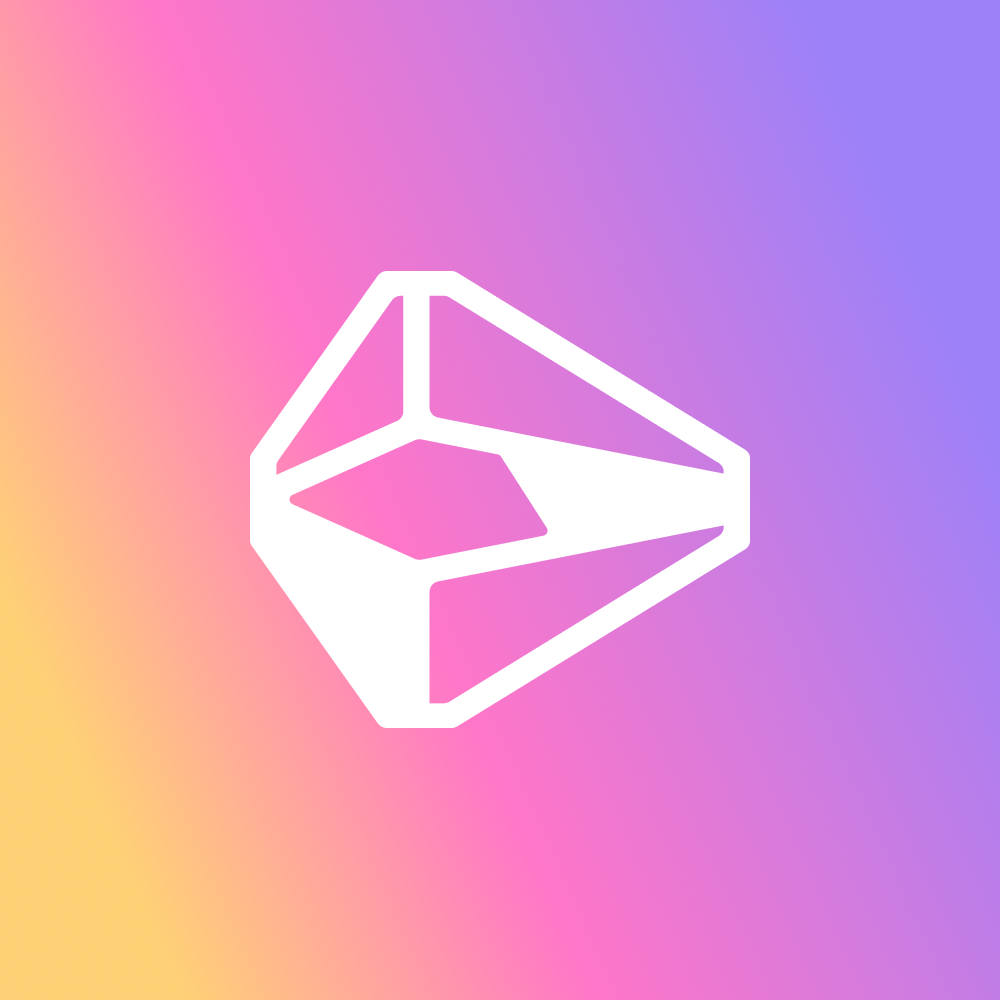
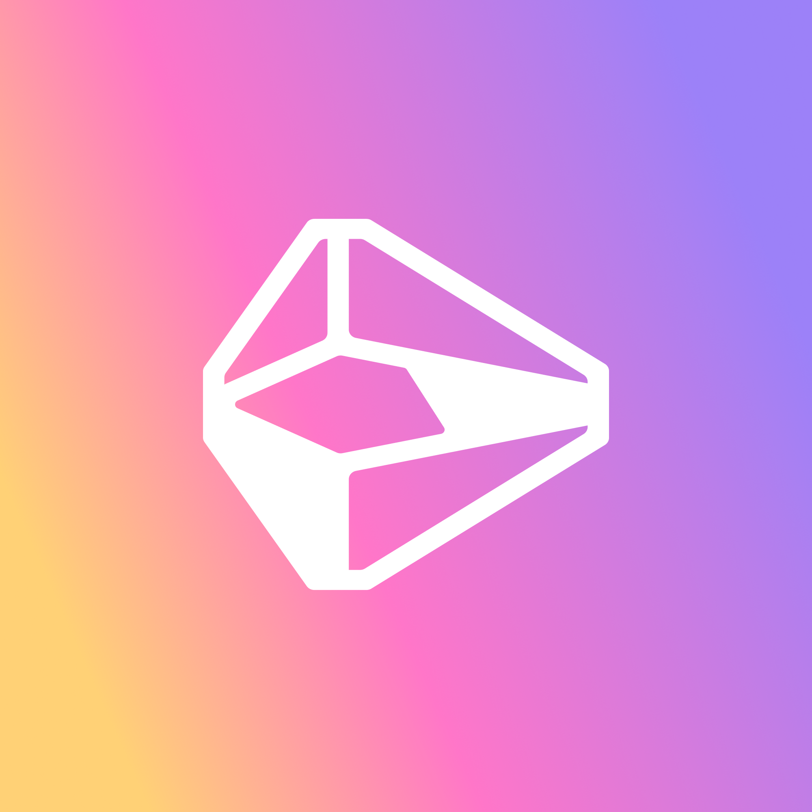

# Staketab Brand Kit

Staketab is a staking provider. Our team is engaged in professional validation in various blockchain networks. We develop fast and high-quality explorers and other ecosystem tools.

| Logo | Link |
| ---  | --- |
|  | [Staketab-icon-color.png](https://raw.githubusercontent.com/Staketab/brand-kit/main/Staketab/png/Staketab-icon-color.png), [Staketab-icon-color.svg](https://raw.githubusercontent.com/Staketab/brand-kit/main/Staketab/svg/Staketab-icon-color.svg) |
|  | [Staketab-icon.png](https://raw.githubusercontent.com/Staketab/brand-kit/main/Staketab/png/Staketab-icon.png), [Staketab-icon.svg](https://raw.githubusercontent.com/Staketab/brand-kit/main/Staketab/svg/Staketab-icon.svg) |
|  | [Staketab-icon-white.png](https://raw.githubusercontent.com/Staketab/brand-kit/main/Staketab/png/Staketab-icon-white.png), [Staketab-icon-white.svg](https://raw.githubusercontent.com/Staketab/brand-kit/main/Staketab/svg/Staketab-icon-white.svg) |
|  | [Staketab-logo-vertical-color.png](https://raw.githubusercontent.com/Staketab/brand-kit/main/Staketab/png/Staketab-logo-vertical-color.png), [Staketab-logo-vertical-color.svg](https://raw.githubusercontent.com/Staketab/brand-kit/main/Staketab/svg/Staketab-logo-vertical-color.svg) |
|  | [Staketab-logo-vertical-color-white.png](https://raw.githubusercontent.com/Staketab/brand-kit/main/Staketab/png/Staketab-logo-vertical-color-white.png), [Staketab-logo-vertical-color-white.svg](https://raw.githubusercontent.com/Staketab/brand-kit/main/Staketab/svg/Staketab-logo-vertical-color-white.svg) |
|  | [Staketab-logo-vertical-white.png](https://raw.githubusercontent.com/Staketab/brand-kit/main/Staketab/png/Staketab-logo-vertical-white.png), [Staketab-logo-vertical-white.svg](https://raw.githubusercontent.com/Staketab/brand-kit/main/Staketab/svg/Staketab-logo-vertical-white.svg) |
|  | [Staketab-logo-vertical.png](https://raw.githubusercontent.com/Staketab/brand-kit/main/Staketab/png/Staketab-logo-vertical.png), [Staketab-logo-vertical.svg](https://raw.githubusercontent.com/Staketab/brand-kit/main/Staketab/svg/Staketab-logo-vertical.svg) |
|  | [Staketab-vert.png](https://raw.githubusercontent.com/Staketab/brand-kit/main/Staketab/png/Staketab-vert.png), [Staketab-vert.svg](https://raw.githubusercontent.com/Staketab/brand-kit/main/Staketab/svg/Staketab-vert.svg) |
|  | [Staketab-vert-color.png](https://raw.githubusercontent.com/Staketab/brand-kit/main/Staketab/png/Staketab-vert-color.png), [Staketab-vert-color.svg](https://raw.githubusercontent.com/Staketab/brand-kit/main/Staketab/svg/Staketab-vert-color.svg) |
|  | [Staketab-vert-white.png](https://raw.githubusercontent.com/Staketab/brand-kit/main/Staketab/png/Staketab-vert-white.png), [Staketab-vert-white.svg](https://raw.githubusercontent.com/Staketab/brand-kit/main/Staketab/svg/Staketab-vert-white.svg) |
|  | [Staketab-logo-big-color.png](https://raw.githubusercontent.com/Staketab/brand-kit/main/Staketab/png/Staketab-logo-big-color.png), [Staketab-logo-big-color.svg](https://raw.githubusercontent.com/Staketab/brand-kit/main/Staketab/svg/Staketab-logo-big-color.svg) |
|  | [Staketab-logo-big-purple.png](https://raw.githubusercontent.com/Staketab/brand-kit/main/Staketab/png/Staketab-logo-big-purple.png), [Staketab-logo-big-purple.svg](https://raw.githubusercontent.com/Staketab/brand-kit/main/Staketab/svg/Staketab-logo-big-purple.svg) |
|  | [Staketab-logo-biggest-color.png](https://raw.githubusercontent.com/Staketab/brand-kit/main/Staketab/png/Staketab-logo-biggest-color.png), [Staketab-logo-biggest-color.svg](https://raw.githubusercontent.com/Staketab/brand-kit/main/Staketab/svg/Staketab-logo-biggest-color.svg) |
|  | [Staketab-logo-biggest-color-white.png](https://raw.githubusercontent.com/Staketab/brand-kit/main/Staketab/png/Staketab-logo-biggest-color-white.png), [Staketab-logo-biggest-color-white.svg](https://raw.githubusercontent.com/Staketab/brand-kit/main/Staketab/svg/Staketab-logo-biggest-color-white.svg) |
|  | [Staketab-logo-biggest-purple.png](https://raw.githubusercontent.com/Staketab/brand-kit/main/Staketab/png/Staketab-logo-biggest-purple.png), [Staketab-logo-biggest-purple.svg](https://raw.githubusercontent.com/Staketab/brand-kit/main/Staketab/svg/Staketab-logo-biggest-purple.svg) |

